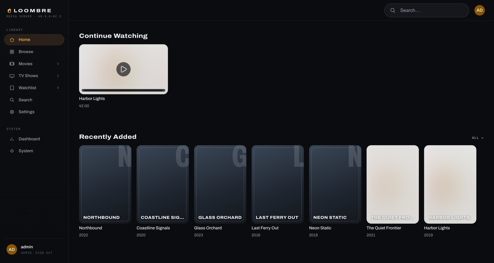
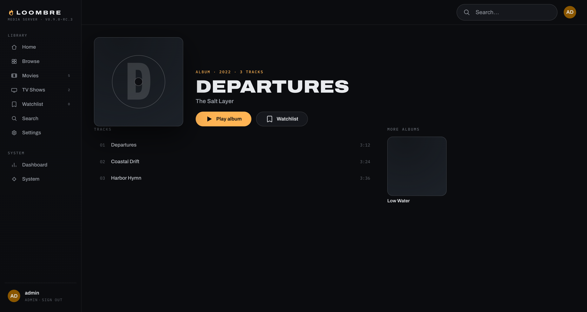
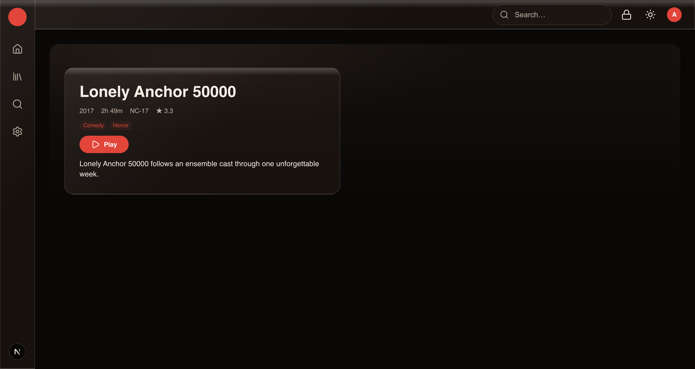

<p align="center">
  
</p>

<h1 align="center">Loombre</h1>

<p align="center"><strong>Your movies, shows, and music — on your own hardware, under your own rules.</strong></p>

<p align="center">
  <a href="https://github.com/Loombre/Loombre/releases"></a>
  <a href="https://github.com/Loombre/Loombre/actions/workflows/ci.yml"></a>
  <a href="LICENSE"></a>
  <a href=".nvmrc"></a>
  <a href="https://www.loombre.com/docs"></a>
</p>

<p align="center">
  <a href="#install">Install</a> ·
  <a href="#screenshots">Screenshots</a> ·
  <a href="#why-loombre">Why Loombre</a> ·
  <a href="#documentation">Documentation</a> ·
  <a href="#reporting-a-problem">Report a problem</a> ·
  <a href="#contributing">Contributing</a>
</p>

---

Loombre is a self-hosted media server: one install that organizes your
movies, TV shows, and music and streams them to any browser — on your own
network or away from home. It is built from the ground up, contract-first,
on PostgreSQL. It is not a fork, client, or compatible implementation of any
other media server, and it shares no API surface, schema, or naming with one.

## The beta

> **Loombre is version `1.0.0-beta.2`, pre-release** — the tester line that
> began with beta.1 on 2026-09-03: packaged installers for Linux (`.rpm` and
> `.deb` from beta.2, plus the tarball), Windows, and macOS, Docker images on
> GHCR, and checksums, signatures, and build attestations for every file.
> **[Release page →](https://github.com/Loombre/Loombre/releases/tag/v1.0.0-beta.2)**

What "beta" means here:

- **The v1 feature set is in.** Movies, TV, and music; multi-user accounts and
  permissions; remote access; restricted content; the full admin surface. The
  beta line exists to find what real libraries on real hardware turn up before
  `1.0.0-rc.1`, the build meant to ship as `1.0.0` unchanged. The path from
  here is `1.0.0-beta.N` → `1.0.0-rc.1` → `1.0.0`.
- **Betas are quiet.** The built-in update check only reads the latest stable
  release, so it never announces a beta. Testers move between betas by hand,
  from the Releases page.
- **The installers are unsigned** — no Apple notarization, no Windows
  Authenticode. That is deliberate (see [Verifying releases](#verifying-releases)),
  so expect a Gatekeeper or SmartScreen prompt on first launch. Each platform
  guide has the exact click-through.
- **Your reports are the point.** The [issue forms](https://github.com/Loombre/Loombre/issues/new/choose)
  ask for exactly what a fix needs — see [Reporting a problem](#reporting-a-problem).

## Screenshots

| Home screen | Now playing |
|---|---|
|  |  |
| **Browsing a music library** | **Movie detail page** |
|  |  |
| **HDR content, tone-mapped for a non-HDR display** | |
|  | |

## Why Loombre

Design choices made at the start, not bolted on later:

- **PostgreSQL from day one.** Real columns, foreign keys, and enums.
  Concurrent writes and scaling out are not a future migration project.
- **Content filtering enforced at the data layer, not the UI.** Restricted
  libraries never appear in everyday search, browsing, home rails, or
  "recently added" at all. They are reachable only inside a dedicated
  restricted zone, and only after every gate passes — server capability, adult
  age verification, opt-in PIN, explicit per-library grant, live session
  unlock — server-side, by construction, not by a client politely agreeing to
  hide something.
- **Budget hardware is a first-class target.** A ~$100 mini PC (Tier-0:
  4-core, 4 GB RAM) is a real
  [performance budget enforced in CI](docs/developer-guide/architecture/performance-budgets.md),
  not a degraded experience.
- **One contract, one generated SDK.** `packages/contract/openapi.yaml` is
  the source of truth. The client SDK is generated from it and tested for
  drift, so the API and what consumes it can never quietly disagree.
- **A pure, offline-testable playback decision engine.** Whether — and why — a
  file needs converting for a given device is a deterministic function with a
  500+ case regression matrix, not logic smeared across request handlers and
  discovered wrong in production.
- **No telemetry, analytics, or phone-home of any kind.** Not opt-in, not
  behind a flag — architecturally absent, enforced by a CI grep gate. Crash
  logs stay on your machine.

## What's in the box

| Area | What ships in 1.0 |
|---|---|
| **Media types** | Movies, TV, and music. |
| **Playback** | Direct play when your device supports the file as-is; automatic on-the-fly conversion — with a documented, reason-coded decision — when it doesn't. Fast seeking, HDR tone-mapping, text subtitles. |
| **Multi-user** | Per-user accounts, per-library permission grants, invitations, remote access. |
| **Restricted content** | A native, opt-in, PIN-gated, server-enforced content class — never mixed into everyday browsing or search, reachable only inside its own zone once every gate passes. |
| **Scanning** | Incremental, idempotent, rename-aware; watches your library folders continuously. |
| **Metadata** | Provider-based lookup for movies, TV, and music, with local NFO and tag data always taking precedence over anything fetched. |
| **Remote access** | Three first-class, mutually exclusive paths — Loombre Remote, Tunnel, or Direct — plus LAN-only. See [Remote access](#remote-access). |
| **Data freedom** | Export your whole catalog and watch progress as an open JSON archive; import it into another instance. No lock-in, by design. |
| **Hardware tiers** | Explicit Tier-0/1/2 support, each with performance budgets enforced in CI. |
| **Telemetry** | None. Ever. Architecturally absent, not a setting. |
| **License** | AGPL-3.0-only. |

**Planned, not built yet:** photos, live TV, and native mobile and TV apps.
The data model already accounts for them; none of them is in the beta.

## Install

**Requirements.** Tier-0 is the floor and is fully supported: a 4-core CPU at
2 GHz, 4 GB RAM, and whatever disk holds your media. The native installers
bundle everything else — Node, ffmpeg, and an embedded PostgreSQL. The Docker
path needs Docker Engine 24+ with the Compose v2 plugin. Full tier table and
per-platform prerequisites: [docs/install/index.md](docs/install/index.md).

### Downloads

Every artifact below is on the
**[releases page](https://github.com/Loombre/Loombre/releases)**,
alongside `SHA256SUMS`, `manifest.json`, and their minisign signatures.

| Platform | What you get | Guide |
|---|---|---|
| **Docker Compose** (recommended) | `ghcr.io/loombre/loombre` + `ghcr.io/loombre/loombre-web`, tag `1.0.0-beta.2`, cosign-signed | [docs/install/docker.md](docs/install/docker.md) |
| **Linux** x64 | `.rpm` and `.deb` packages, or a tarball with systemd units and the `loombre` CLI | [docs/install/linux.md](docs/install/linux.md) |
| **Windows** x64 | `.exe` installer: Windows services plus a system-tray controller | [docs/install/windows.md](docs/install/windows.md) |
| **macOS** Apple Silicon and Intel | `.pkg` installer: LaunchDaemons plus a menubar controller (Intel builds are published on a demand basis) | [docs/install/macos.md](docs/install/macos.md) |

### Quick start (Docker Compose)

```bash
git clone https://github.com/Loombre/Loombre.git && cd Loombre
cp installers/docker/loombre.env.example installers/docker/loombre.env
$EDITOR installers/docker/loombre.env   # set POSTGRES_PASSWORD and LOOMBRE_JWT_SECRET at minimum

# Use the published images (leave these unset to build from source instead)
export LOOMBRE_IMAGE=ghcr.io/loombre/loombre:1.0.0-beta.2
export LOOMBRE_WEB_IMAGE=ghcr.io/loombre/loombre-web:1.0.0-beta.2
docker compose -f docker-compose.prod.yml --env-file installers/docker/loombre.env pull

# 1) Postgres first; let it report healthy
docker compose -f docker-compose.prod.yml --env-file installers/docker/loombre.env up -d postgres

# 2) apply the schema (this is also the upgrade command)
docker compose -f docker-compose.prod.yml --env-file installers/docker/loombre.env run --rm server \
  node packages/db/scripts/migrate.mjs migrate

# 3) server + worker + web UI
docker compose -f docker-compose.prod.yml --env-file installers/docker/loombre.env up -d
```

### First run

Open `http://<this host>:3000` (the HTTP API is on `:3001`). The first time
you open it, a setup wizard walks you through creating the admin account,
pointing Loombre at your library folders, probing the hardware, and,
optionally, turning on restricted content or restoring from a backup. There
is no default admin account and no manual step to create one. Walkthrough:
[docs/admin-guide/wizard.md](docs/admin-guide/wizard.md).

Browsing from another machine on your network needs two origins set in
`loombre.env`; the [Docker guide](docs/install/docker.md) shows exactly
which. Everything else — the other platforms, upgrades, troubleshooting —
starts at [docs/install/index.md](docs/install/index.md).

### Running from source

Needs Node 24, pnpm 11, and Docker (`pnpm dev` starts PostgreSQL on host port
5442 via `docker-compose.dev.yml`). Full walkthrough, from a clean clone to a
green gate: [docs/developer-guide/getting-started.md](docs/developer-guide/getting-started.md).

```bash
pnpm install
docker compose -f docker-compose.dev.yml up -d   # PostgreSQL on host port 5442
pnpm db:migrate && pnpm db:seed                  # first run only: schema + seed data
pnpm dev
pnpm gate
```

## Verifying releases

Loombre ships **unsigned installers** — no Apple notarization, no
Authenticode. Those certificates cost money, and this project has no revenue
and no telemetry to fund them from. In their place, every release carries
three independent layers of trust. Use whichever you are comfortable with;
the first one needs no key handling at all.

```bash
# 1. Attestation — built by this repository's own CI, from this repo, at this commit
gh attestation verify <downloaded-file> --repo Loombre/Loombre

# 2. minisign signature — the release manager's own key (published in keys/minisign.pub,
#    docs/ops/updating.md, and every release's notes)
minisign -Vm SHA256SUMS -P <public key>

# 3. Checksum — what you downloaded is what was published
sha256sum --ignore-missing -c SHA256SUMS
```

Docker images are additionally signed keyless via cosign, using GitHub's OIDC
identity:

```bash
cosign verify \
  --certificate-identity-regexp "^https://github.com/Loombre/Loombre/" \
  --certificate-oidc-issuer https://token.actions.githubusercontent.com \
  ghcr.io/loombre/loombre:1.0.0-beta.2
```

The full trust model is in
[the install guide](docs/install/index.md#why-are-the-installers-unsigned).
The built-in update checker is notify-only — it never downloads, installs, or
applies anything — and its exact network request is specified byte for byte
in [docs/ops/updating.md](docs/ops/updating.md).

## Remote access

Three first-class, mutually exclusive ways to reach Loombre from outside your
own network — a decision tree, an honest comparison, and one self-contained
guide per path: [docs/ops/remote-access/](docs/ops/remote-access/index.md).

- **[Loombre Remote](docs/ops/remote-access/loombre-remote.md)** — a private
  network built into Loombre itself, no third party involved.
- **[Tunnel](docs/ops/remote-access/tunnel.md)** — Cloudflare Tunnel, no open
  ports on your router.
- **[Direct](docs/ops/remote-access/direct.md)** — your server, directly on
  the public internet, with its own certificate (built-in ACME or your own
  reverse proxy: [acme.md](docs/ops/remote-access/acme.md) /
  [reverse-proxy.md](docs/ops/remote-access/reverse-proxy.md)).
- **LAN-only** — no TLS, no port-forward, no extra configuration; see the
  final section of [reverse-proxy.md](docs/ops/remote-access/reverse-proxy.md).

Pick one; don't mix two on the same install.

## Documentation

| Guide | Who it's for |
|---|---|
| [Install](docs/install/index.md) | Platform chooser, system requirements, verifying a release, troubleshooting. |
| [User Guide](docs/user-guide/index.md) | Anyone watching or listening. Plain language, no jargon — including [why a title is converting](docs/user-guide/why-is-it-converting.md) and [what each playback error code means](docs/user-guide/playback-errors.md). |
| [Admin Guide](docs/admin-guide/index.md) | Whoever runs the server, from the settings screens. |
| [Operator Guide](docs/ops/index.md) | The technical self-hoster: reverse proxies, TLS, backups, external PostgreSQL, updating. |
| [Developer Guide](docs/developer-guide/index.md) | Architecture tour, contract-first workflow, the playback matrix regression law. |
| [API Reference](docs/api-reference/index.md) | Generated from the OpenAPI contract. |

The same guides are published at
[www.loombre.com/docs](https://www.loombre.com/docs); the links above are
repo-relative. `pnpm docs:build` builds the identical site locally into
`docs/.vitepress/dist/`.

**Project internals:** [docs/PLAN.md](docs/PLAN.md) is the authoritative
technical spec and [docs/PLAYBACK.md](docs/PLAYBACK.md) the playback engine
specification (neither is published to the docs site);
[CHANGELOG.md](CHANGELOG.md) has the release history,
[CONTRIBUTING.md](CONTRIBUTING.md) the contribution rules,
[SECURITY.md](SECURITY.md) private disclosure, and
[LICENSE-INTENT.md](LICENSE-INTENT.md) dependency provenance.

## Privacy & license

Loombre is licensed under **[AGPL-3.0-only](LICENSE)** — see
[LICENSE-INTENT.md](LICENSE-INTENT.md) for dependency provenance and the
relicense history.

**No telemetry, analytics, or phone-home of any kind — architecturally, not
by policy.** Loombre never reports anything about you or your library to
anyone. The only network request the server ever makes unprompted is the
built-in, notify-only update check (fully specified in
[docs/ops/updating.md](docs/ops/updating.md), and switchable off); metadata
provider lookups (TMDB/TVDB/MusicBrainz) happen only for libraries you
configure, using keys you supply. Crash logs are written locally and never
transmitted. A CI gate (`grep-gates`, part of `pnpm gate`) scans the entire
source tree for known telemetry SDK import patterns and fails the build if it
finds one — enforced, not aspirational.

## Reporting a problem

Bug reports from the betas are what turn `beta.N` into `rc.1`. Pick the form
that fits at **[New issue](https://github.com/Loombre/Loombre/issues/new/choose)**:

| Form | Use it when |
|---|---|
| **Bug report** | Something doesn't work the way it should. |
| **Playback problem** | A title won't play, stutters, seeks badly, or converts when you think it shouldn't. |
| **Install or upgrade problem** | The installer, the Compose stack, first boot, or an upgrade didn't go as documented. |
| **Documentation** | A page is wrong, missing, or confusing. |
| **Feature request** | Something Loombre should do, or do differently. |

The forms ask for the few things every fix needs: the Loombre version (admin
**Dashboard → System**, or `loombre --version` where the CLI is installed),
how you installed it, and the relevant logs — the
[troubleshooting page](docs/install/troubleshooting.md) lists where each
platform writes them. For playback problems, use **Copy details** on the
error screen and paste what it copied; the error code is the single most
useful thing you can include.

**Found a security issue?** Please don't file it publicly — use
[GitHub's private vulnerability reporting](https://github.com/Loombre/Loombre/security/advisories/new).
[SECURITY.md](SECURITY.md) covers scope and what to include.

## Contributing

- **[CONTRIBUTING.md](CONTRIBUTING.md)** — the short version:
  feedback-loop-first (no code before a failing check exists), `pnpm gate:full`
  must pass, and new playback decision rules ship with matrix cases in the
  same PR.
- **[CODE_OF_CONDUCT.md](CODE_OF_CONDUCT.md)** — the standards expected of
  everyone taking part, maintainers included.
- **[docs/developer-guide/getting-started.md](docs/developer-guide/getting-started.md)** —
  clean clone to green gate, prerequisites included.
