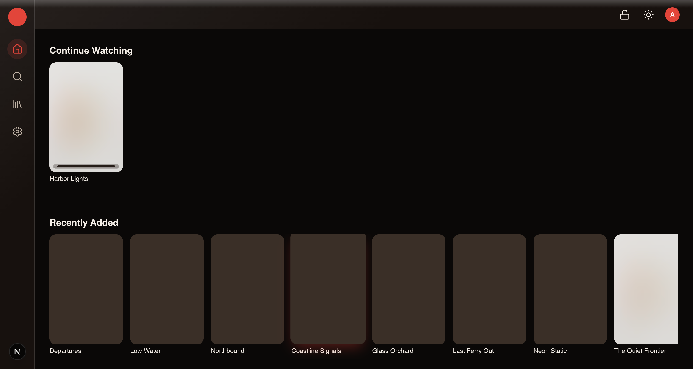
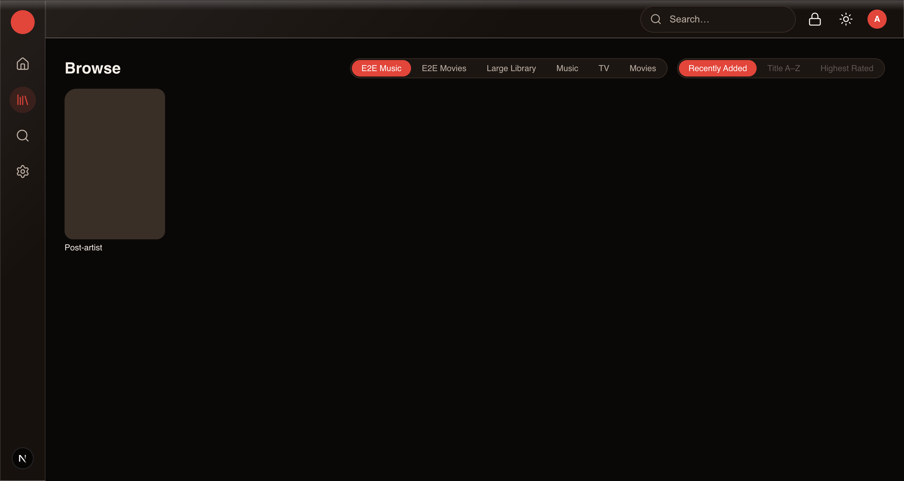

# Loombre

**Your movies, shows, and music — on your own hardware, under your own rules.**

Loombre is a ground-up, self-hosted media streaming platform: a server, a
web client, and (later) native apps, all built contract-first on
PostgreSQL. It organizes and streams your library — locally and remotely
— to any device. It is not a fork, client, or compatible implementation of
any other media server; it shares no API surface, schema, or naming with
one.

**Status:** version `0.9.0`, private, pre-release — no tagged release has
shipped yet. `docs/PLAN.md` is the authoritative technical spec, if you
want the full design reasoning behind everything below.

## Why Loombre exists

A few design choices, made from the start rather than bolted on later:

- **PostgreSQL from day one** — real columns, foreign keys, and enums;
  concurrent writes and horizontal scale aren't an eventual migration
  project.
- **Content filtering enforced at the data layer, not the UI.** Restricted
  libraries are invisible in search, browsing, and "recently added" until
  every gate (server capability, adult age verification, opt-in PIN,
  explicit per-library grant, live session unlock) passes — server-side,
  by construction, not by a client politely agreeing to hide something.
- **Budget hardware is a first-class target.** A ~$100 mini PC (Tier-0:
  4-core, 4 GB RAM) is a real, enforced performance budget in CI, not a
  degraded experience.
- **One contract, one generated SDK.** `packages/contract/openapi.yaml` is
  the source of truth; the client SDK is generated from it and tested for
  drift, so the API and what consumes it can never quietly disagree.
- **A pure, offline-testable playback decision engine.** Whether — and
  why — a file needs converting for a given device is a deterministic
  function with a 500+ case regression matrix, not logic smeared across
  request handlers and only found wrong in production.
- **No telemetry, analytics, or phone-home of any kind.** Not opt-in, not
  behind a flag — architecturally absent, enforced by a CI grep gate.
  Crash logs stay on your machine.

## Screenshots

<!-- Convention: real screenshots where captured; [SCREENSHOT: …]
     placeholders everywhere else, per the docs suite's established
     convention (see docs/install/macos.md, docs/install/windows.md). -->

| | |
|---|---|
|  Home screen |  Now playing |
|  Browsing a music library |  Movie detail page |
|  HDR content, tone-mapped for a non-HDR display | *(screenshot coming after the release smoke tests)* Admin dashboard |

*(screenshot coming after the release smoke tests)*
*(screenshot coming after the release smoke tests)*

## Feature matrix

| | |
|---|---|
| **Media types** | Movies, TV, music (v1). Photos, live TV, and native mobile/TV apps are schema-anticipated, not yet built. |
| **Multi-user** | Per-user accounts, per-library permission grants, remote access. |
| **Restricted content** | Native, opt-in, PIN-gated, server-enforced content class — invisible unless every gate passes. |
| **Playback** | Direct play when your device supports the file as-is; automatic, on-the-fly conversion (with a documented, reason-coded decision) when it doesn't. |
| **Scanning** | Incremental, idempotent, rename-aware; watches your library folders continuously. |
| **Metadata** | Provider-based lookup (movies/TV/music), with local NFO/tag data always taking precedence over anything fetched remotely. |
| **Remote access** | Three first-class, documented paths: your own reverse proxy, built-in ACME (Let's Encrypt), or LAN-only — see [Remote access](#remote-access-three-first-class-paths-p44) below. |
| **Data freedom** | Export your entire catalog and progress as an open JSON archive; import it into another instance. No lock-in by design. |
| **Hardware tiers** | Explicit Tier-0/1/2 support, each with enforced performance budgets in CI — see [Performance budgets](#performance-budgets-docsplanmd9-statemd-p26d15-enforcing) below. |
| **Telemetry** | None. Ever. Architecturally absent, not a setting. |
| **License** | AGPL-3.0-only. |

## Quick start (Docker/Compose, recommended)

This is the exact sequence from
**[docs/install/docker.md](docs/install/docker.md)** — that page is the
authoritative version if the two ever drift; this is a mirror, not a
separate quickstart.

```bash
git clone https://github.com/Loombre/Loombre.git   # or your own release checkout
cd Loombre

cp installers/docker/loombre.env.example installers/docker/loombre.env
$EDITOR installers/docker/loombre.env   # set POSTGRES_PASSWORD and LOOMBRE_JWT_SECRET at minimum

# 1) bring up Postgres and wait for it to report healthy
docker compose -f docker-compose.prod.yml --env-file installers/docker/loombre.env up -d postgres

# 2) apply the schema (also the upgrade command — see docs/install/docker.md)
docker compose -f docker-compose.prod.yml --env-file installers/docker/loombre.env run --rm server \
  node packages/db/scripts/migrate.mjs migrate

# 3) bring up the server + worker
docker compose -f docker-compose.prod.yml --env-file installers/docker/loombre.env up -d
```

Loombre is now reachable at `http://<this host>:3001`. A first-run web
setup wizard (admin account → library paths → hardware probe → optional
restricted-content setup → optional restore-from-backup) runs the first
time you open it — see `docs/admin-guide/wizard.md` for the full
walkthrough.

Other install paths — Linux tarball + systemd, Windows MSI, macOS `.pkg`
— are documented in full starting at **[docs/install/index.md](docs/install/index.md)**.

## Prerequisites (for running from source / contributing)

- Node 24
- pnpm 11
- Docker

```bash
pnpm install
pnpm dev
pnpm gate
```

The dev environment starts PostgreSQL on host port 5442 via
`docker-compose.dev.yml`. See the Developer Guide's
[getting-started page](docs/developer-guide/getting-started.md) for the
full walkthrough.

## Documentation

The full documentation suite, organized by audience — no hosted copy is
published yet (no CI step deploys it anywhere as of this writing), so
these are repo-relative links; run `pnpm docs:build` to build the actual
site locally (output: `docs/.vitepress/dist/`):

- **[Install](docs/install/index.md)** — platform chooser, system requirements, verifying a release.
- **[User Guide](docs/user-guide/index.md)** — for anyone watching or listening. Plain language, no jargon.
- **[Admin Guide](docs/admin-guide/index.md)** — for whoever runs the server, from the settings screens.
- **[Operator Guide](docs/ops/index.md)** — for the technical self-hoster: reverse proxies, TLS, backups, external PostgreSQL.
- **[Developer Guide](docs/developer-guide/index.md)** — architecture tour, contract-first workflow, the playback matrix regression law.
- **[API Reference](docs/api-reference/index.md)** — generated from the OpenAPI contract (`pnpm docs:build` required to generate the actual reference content).

Reference documents:
- [docs/PLAN.md](docs/PLAN.md) — Technical development plan (authoritative spec; internal, not published to the docs site)
- [docs/PLAYBACK.md](docs/PLAYBACK.md) — Playback engine specification (internal, not published to the docs site)
- [docs/ops/reverse-proxy.md](docs/ops/reverse-proxy.md) — Caddy/nginx/Traefik recipes, trust-proxy + CORS config
- [docs/ops/acme.md](docs/ops/acme.md) — Built-in ACME (Let's Encrypt): setup, the port-privilege story, DNS-01 hook scripts, renewal
- [docs/ops/backup.md](docs/ops/backup.md) — What to back up (and explicitly not), embedded + external PostgreSQL, restore drill
- [docs/ops/external-postgres.md](docs/ops/external-postgres.md) — Running Loombre against your own PostgreSQL instead of the embedded one
- [docs/ops/systemd.md](docs/ops/systemd.md) — systemd unit pointer (full content: `docs/install/linux.md`)
- [docs/ops/updating.md](docs/ops/updating.md) — Update checker configuration + exact network request contents
- [keys/README.md](keys/README.md) — Release-signing key generation, rotation, and the three-location consistency check
- [CHANGELOG.md](CHANGELOG.md) — Release/phase history
- [STATE.md](STATE.md) — Goals, decisions, and open items
- [CONTRIBUTING.md](CONTRIBUTING.md) — How to contribute: the gate, contract-first rules, the matrix regression law
- [SECURITY.md](SECURITY.md) — Reporting a vulnerability privately
- [LICENSE-INTENT.md](LICENSE-INTENT.md) — Dependency provenance and licensing rules

## Verifying a release (P4.9)

Loombre ships **unsigned installers** — no Apple notarization, no
Authenticode. That's a deliberate, honest choice, not an oversight: those
signing certificates cost money, and this project has no revenue and no
telemetry to fund them from. In their place, every release carries
**three independent layers of trust**, so you don't have to take any
single one of them on faith:

1. **GitHub artifact attestation** — the no-key-handling path. Proves a
   downloaded file was actually built by this project's own CI, from this
   exact repository, at this exact commit:
   ```bash
   gh attestation verify <downloaded-file> --repo Loombre/Loombre
   ```
2. **SHA-256 checksums** — plain integrity, no key handling at all:
   ```bash
   sha256sum --ignore-missing -c SHA256SUMS
   ```
3. **minisign signature** — the release manager's own personal blessing on
   the release, verified against a public key published in three places at
   once (this repo's `keys/minisign.pub`, the docs site, and every
   release's notes — see `keys/README.md`):
   ```bash
   minisign -Vm SHA256SUMS -P <public key — see docs/ops/updating.md>
   ```

**Docker images** are additionally signed keyless via
[cosign](https://docs.sigstore.dev/) using GitHub's own OIDC identity
(sigstore) — verify with:
```bash
cosign verify \
  --certificate-identity-regexp "^https://github.com/Loombre/Loombre/" \
  --certificate-oidc-issuer https://token.actions.githubusercontent.com \
  ghcr.io/loombre/loombre:<version>
```

The complete, exact specification of what Loombre's **built-in update
checker** does — and does not — send over the network lives in
[docs/ops/updating.md](docs/ops/updating.md); it never downloads, installs,
or applies anything automatically (docs/PLAN.md §10).

## Remote access: three first-class paths (P4.4)

Loombre supports three equally-documented remote-access setups — pick the
one that matches your situation, don't mix two of them on the same
install:

1. **Reverse proxy** (recommended if you already run one) — Loombre
   speaks plain HTTP; Caddy/nginx/Traefik/etc. terminates TLS and
   forwards to it. Full recipes + the real requirements (WebSocket
   upgrade, no HLS buffering, `?token=` log redaction, upload body-size
   limits, `LOOMBRE_TRUST_PROXY` pairing): **[docs/ops/reverse-proxy.md](docs/ops/reverse-proxy.md)**.
2. **Built-in ACME** (`LOOMBRE_TLS_MODE=acme`) — for direct-exposure
   installs with no reverse proxy: Loombre obtains and renews its own
   Let's Encrypt certificate via HTTP-01 or DNS-01. The honest privilege
   story for binding port 80/443 (systemd `AmbientCapabilities`,
   `setcap`, `authbind`), the DNS-01 hook-script contract, and the
   renewal/hot-swap mechanics: **[docs/ops/acme.md](docs/ops/acme.md)**.
3. **LAN-only, no TLS** — Loombre never leaves a trusted network (VPN-only
   access, no port-forward). No extra configuration beyond the defaults;
   see `docs/ops/reverse-proxy.md`'s final section.

`LOOMBRE_TRUST_PROXY` and `LOOMBRE_CORS_ORIGINS` matter for path 1 (and
sometimes path 3, if your web client's LAN origin differs from
localhost) — both are covered in `docs/ops/reverse-proxy.md` in full,
including why `X-Forwarded-For` is completely inert until you
explicitly opt in (proven both directions: a spoofed header with trust
proxy off in `apps/server/test/trust-proxy-hardening.e2e.spec.ts`, and
with trust proxy on in `apps/server/test/auth-security.e2e.spec.ts`).

### HSTS

`Strict-Transport-Security` is set by Loombre itself exactly when it is
terminating TLS internally (`LOOMBRE_TLS_MODE=manual`/`acme`, path 2) AND
`LOOMBRE_TRUST_PROXY` is unset. Behind a reverse proxy (path 1), the proxy
owns HSTS instead — even if `LOOMBRE_TLS_MODE` also happens to be
non-off — because it's the proxy that's the browser's actual TLS
endpoint. See `docs/ops/acme.md`'s "HSTS" section for the exact rule, or
`apps/server/src/tls/hsts.ts` for the implementation + rationale. For
path 1 (reverse proxy), add HSTS at the proxy layer yourself — e.g. for
the nginx recipe in `docs/ops/reverse-proxy.md`:

```nginx
add_header Strict-Transport-Security "max-age=63072000; includeSubDomains" always;
```

## Performance budgets (docs/PLAN.md §9, STATE.md P2.6/D15 — ENFORCING)

Three blocking CI jobs (`perf-t0`, `perf-web-budget`, `perf-lighthouse` in
`.github/workflows/ci.yml`), all `ubuntu-latest`-only:

| Budget | Enforced by | Command |
|---|---|---|
| Server idle RSS <= 220 MB | `scripts/perf-t0.mjs` | `pnpm perf:t0` |
| Endpoint p95 <= 100ms (browse, item detail, continue-watching, search-as-you-type) @ 50k-item seed | `scripts/perf-t0.mjs` | `pnpm perf:t0` |
| Scan throughput >= 200 files/min | `scripts/perf-t0.mjs` | `pnpm perf:t0` |
| `/browse` first-load JS <= 200 KB gz | `scripts/perf-web-budget.mjs` | `pnpm perf:web-budget` |
| Lighthouse performance >= 0.90 (throttled mobile, `/login`) | `apps/web/lighthouserc.cjs` (`@lhci/cli` via pinned npx — kept OUT of the workspace lockfile: lighthouse transitively depends on a crash-reporting SDK that the D14 telemetry grep-gate bans from the repo; error reporting is opt-in and never enabled) | `pnpm perf:lighthouse` |

`pnpm perf:t0` needs `pnpm db:seed && pnpm db:seed-large` run first (the
50k-item library its endpoint measurements run against) and a built
`apps/server` (`pnpm --filter "@loombre/server..." run build`).
`pnpm perf:lighthouse` needs a built + running `apps/web` (`next start` —
handled by `lighthouserc.cjs`'s `startServerCommand`) and builds it itself
via `pnpm perf:web-budget`'s own step, or you can build first.

The stack idle-RSS figure named in plan §9.2 (server + worker + embedded PG
<= 500 MB) is measured and reported (server + worker, best-effort) but NOT
hard-enforced: embedded PG doesn't exist yet (a Phase-4 packaging concern),
so a server+worker-only sum can't honestly represent the number it's named
after.

### `perf/baselines.json` — update-requires-reason

`perf/baselines.json` is a hand-curated ledger of every enforced budget's
value + last-measured number + a `reason` string explaining it. If a PR
changes ANY field of an existing entry — the budget itself, or a
`lastMeasured*` figure — vs the copy on `main`, that entry's `reason` MUST
also change in the same diff, or `scripts/perf-baseline-check.mjs` (run in
the `perf-t0` CI job as `pnpm perf:baseline-check`) fails the build. This
makes "quietly loosen a budget" or "quietly baseline away a regression"
impossible without a human explaining why, in the commit that does it.

This is distinct from `perf/t0-baseline.json` and
`perf/web-budget-result.json`, which ARE wholesale-overwritten by every
`pnpm perf:t0` / `pnpm perf:web-budget` run — those are raw measurement
output, not the reasoned ledger.

## License and privacy

Loombre is licensed under **[AGPL-3.0-only](LICENSE)** — see
[LICENSE-INTENT.md](LICENSE-INTENT.md) for dependency provenance and the
relicense history (this repository is currently private; AGPL obligations
attach on conveyance/network use once distributed).

**No telemetry, analytics, or phone-home of any kind — architecturally,
not by policy.** Loombre never reports anything about you or your library
to anyone. The only network request the server ever makes unprompted is
the built-in, notify-only update check (fully specified, byte for byte, in
[docs/ops/updating.md](docs/ops/updating.md)); metadata provider lookups
(TMDB/TVDB/MusicBrainz) happen only for libraries you configure, using
keys you supply. Crash logs are written locally and never transmitted. A
CI gate (`grep-gates`, part of `pnpm gate`) scans the entire source tree
for known telemetry SDK import patterns and fails the build if it finds
one — this is enforced, not aspirational.

## Contributing

See [CONTRIBUTING.md](CONTRIBUTING.md) — the short version: feedback-loop-
first (no code before a failing check exists), `pnpm gate` must pass, and
new playback decision rules ship with matrix cases in the same PR. Found a
security issue? See [SECURITY.md](SECURITY.md) instead of filing a public
issue.
